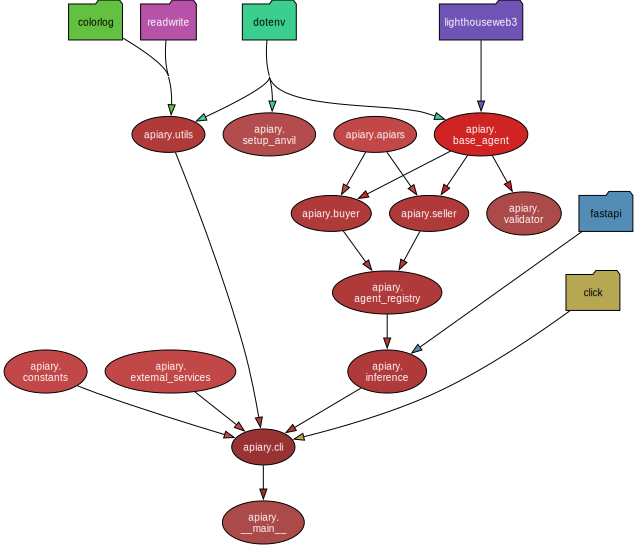

# Apiary

## Overview

CoopHive is a decentralized marketplace for computational resources, allowing clients to execute workloads in a permissionless environment. Participants can connect their compute nodes to the network, perform tasks, and earn compensation. The platform utilizes EVM-compatible interfaces to facilitate payments and manage data storage.

Apiary serves as the user-friendly interface, providing seamless access to the CoopHive protocol and enabling efficient interaction with its features.

### Package Structure

<p align="center">
  
</p>

## Installation

### Requirements

- Python >= 3.12

    Before proceeding, you can check if you have the correct Python version installed by running:

    ```bash
    python3 --version
    ```

    If Python 3.12 or higher is not installed, you can download the latest version from the [official Python website](https://www.python.org/downloads/). For Linux or macOS users, you can use a package manager to install the latest version:

    ```bash
    # For Linux (Ubuntu)
    sudo apt-get update
    sudo apt-get install python3.12

    # For macOS using Homebrew
    brew update
    brew install python@3.12
    ```

- Podman

    Podman is the container management tool used in Apiary. Unlike Docker, Podman does not require a central daemon to run containers, which allows for better security and system efficiency.

    You can install Podman by following the instructions provided in the [official Podman installation documentation](https://podman.io/docs/installation).

    After installation, you can verify if Podman is installed correctly by running:

    ```bash
    podman --version
    ```
### Setup

1. Clone the repository:

   ```bash
   git clone https://github.com/CoopHive/Apiary.git
   cd Apiary
2. Install bun, cargo, uv (if not already installed)

    ```bash
    make bun-download
    make cargo-download
    make uv-download
Please export the necessary paths or start a new session before proceeding.

3. Install dependencies and set up pre-commit hooks:

    ```bash
    make install
5. Populate all the necessary environmental variables and/or confguration file (see [.env.example](https://github.com/CoopHive/Apiary/blob/main/.env.example)):
    - REDIS_URL
    - RPC_URL
    - ERC20_PAYMENT_OBLIGATION
    - ERC721_PAYMENT_OBLIGATION
    - JOB_RESULT_OBLIGATION
    - EAS_CONTRACT
    - LIGHTHOUSE_TOKEN
    - PRIVATE_KEY
    - PUBLIC_KEY
    - INFERENCE_ENDPOINT.PORT
    - INFERENCE_ENDPOINT.HOST

## Example Usage

### Seller

Simply run:

```bash
apiary --verbose start-sell --config-path ./config/seller_naive.json
apiary --verbose start-sell --config-path ./config/seller_kalman.json
```

### Buyer

#### ERC20

To create a USDC offer, run:

```bash
apiary --verbose start-buy --config-path ./config/buyer_kalman.json --job-path ./jobs/cowsay.Dockerfile --token-data '["ERC20", "0x036CbD53842c5426634e7929541eC2318f3dCF7e", 10]'
```

Create a EURC offer with:

```bash
apiary --verbose start-buy --config-path ./config/buyer_kalman.json --job-path ./jobs/sklearn.Dockerfile --token-data '["ERC20", "0x808456652fdb597867f38412077A9182bf77359F", 100]'
```

#### ERC721

```bash
apiary --verbose start-buy --config-path ./config/buyer_naive.json --job-path ./jobs/cowsay.Dockerfile --token-data '["ERC721", "0x9757694a764de0c6599735D37fecd1d09501fb39", 619]'
```

### Make

To format the code according to the project's style guidelines, run:

    make codestyle
To check the code style without modifying the files, run:

    make check-codestyle
To check the documentation style, run:

    make docs

To run the tests, use:

    make test

To update package diagram, use:

    make diagram
