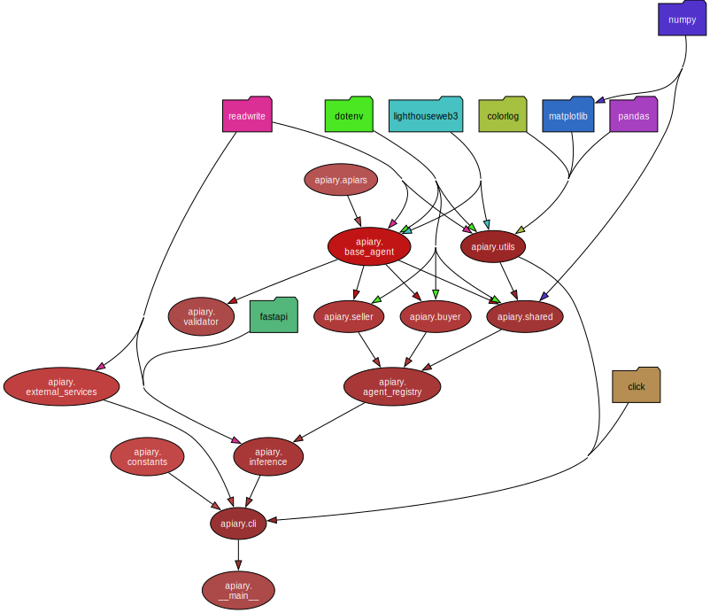

# Apiary

## Overview

CoopHive is a decentralized marketplace for computational resources, allowing clients to execute workloads in a permissionless environment. Participants can connect their compute nodes to the network, perform tasks, and earn compensation. The platform utilizes EVM-compatible interfaces to facilitate payments and manage data storage.

Apiary serves as the user-friendly interface, providing seamless access to the CoopHive protocol and enabling efficient interaction with its features.

### Package Structure



## Installation

### Requirements

- Python >= 3.12

### Setup

1. Clone the repository:

   ```bash
   git clone https://github.com/CoopHive/Apiary.git
   cd Apiary
2. Install bun if not already installed)

    ```bash
    make bun-install
3. Install uv (if not already installed)

    ```bash
    make uv-download
4. Install dependencies and set up pre-commit hooks:

    ```bash
    make install
5. Populate all the necessary environmental variables and/or confguration file:
    - REDIS_URL
    - RPC_URL
    - ERC20_PAYMENT_STATEMENT
    - DOCKER_RESULT_STATEMENT
    - EAS_CONTRACT
    - LIGHTHOUSE_TOKEN
    - PRIVATE_KEY
    - PUBLIC_KEY
    - INFERENCE_ENDPOINT.PORT
    - INFERENCE_ENDPOINT.HOST

## Usage

As a seller, simply run:

```bash
apiary --verbose start-sell --config-path ./config/seller_naive.json
```

As a buyer, to create a USDC offer, run:

```bash
apiary --verbose start-buy --config-path ./config/buyer_naive.json --job-path ./jobs/cowsay.Dockerfile --price '["0x036CbD53842c5426634e7929541eC2318f3dCF7e", 1000]'
```
Or create a EURC offer with:

```bash
apiary --verbose start-buy --config-path ./config/buyer_naive.json --job-path ./jobs/cowsay.Dockerfile --price '["0x808456652fdb597867f38412077A9182bf77359F", 1000]'
```
### Make

To format the code according to the project's style guidelines, run:

    make codestyle
To check the code style without modifying the files, run:

    make check-codestyle
To check the documentation style, run:

    make docs

To run the tests, use:

    make test

To update package diagram, use:

    make diagram
