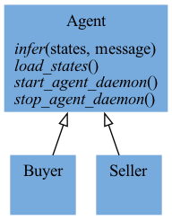
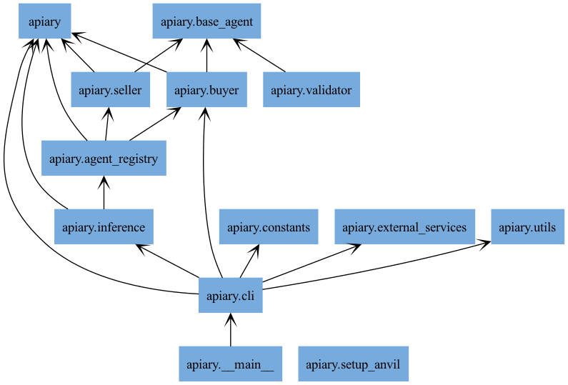

## Reference Literature

The Literature that informed this repository can be found at [this ResearchRabbit Public Collection](https://www.researchrabbitapp.com/collection/public/JLNPJ13R6N).

## Related Python Projects

In order of Stars:

- [OpenHands](https://github.com/All-Hands-AI/OpenHands): An Open Platform for AI Software Developers as Generalist Agents.
- [CrewAI](https://github.com/crewAIInc/crewAI): Framework for orchestrating role-playing, autonomous AI agents.
- [PettingZoo](https://github.com/Farama-Foundation/PettingZoo): An API standard for multi-agent reinforcement learning environments, with popular reference environments and related utilities.
- [Mesa](https://github.com/projectmesa/mesa/): library for agent-based modeling, ideal for simulating complex systems and exploring emergent behaviors.
- [uAgents](https://github.com/fetchai/uAgents): A fast and lightweight framework for creating decentralized agents with ease.
- [Mava](https://github.com/instadeepai/Mava): A research-friendly codebase for fast experimentation of multi-agent reinforcement learning in JAX.
- [meltingpot](https://github.com/google-deepmind/meltingpot): A suite of test scenarios for multi-agent reinforcement learning.
- [EPyMARL](https://github.com/uoe-agents/epymarl): An extension of the PyMARL codebase that includes additional algorithms and environment support.
- [AgentPy](https://github.com/jofmi/agentpy): framework for the development and analysis of agent-based models.
- [VMAS](https://github.com/proroklab/VectorizedMultiAgentSimulator): vectorized differentiable simulator designed for efficient Multi-Agent Reinforcement Learning benchmarking.
- [BenchMARL](https://github.com/facebookresearch/BenchMARL): A collection of MARL benchmarks based on TorchRL.
- [PADE](https://github.com/grei-ufc/pade): Python Agent DEvelopment framework.
- [Repast](https://github.com/Repast/repast4py): agent-based modeling and simulation software.
- [moragents](https://github.com/MorpheusAIs/moragents): Morpheus Local Agents.

## Diagrams

